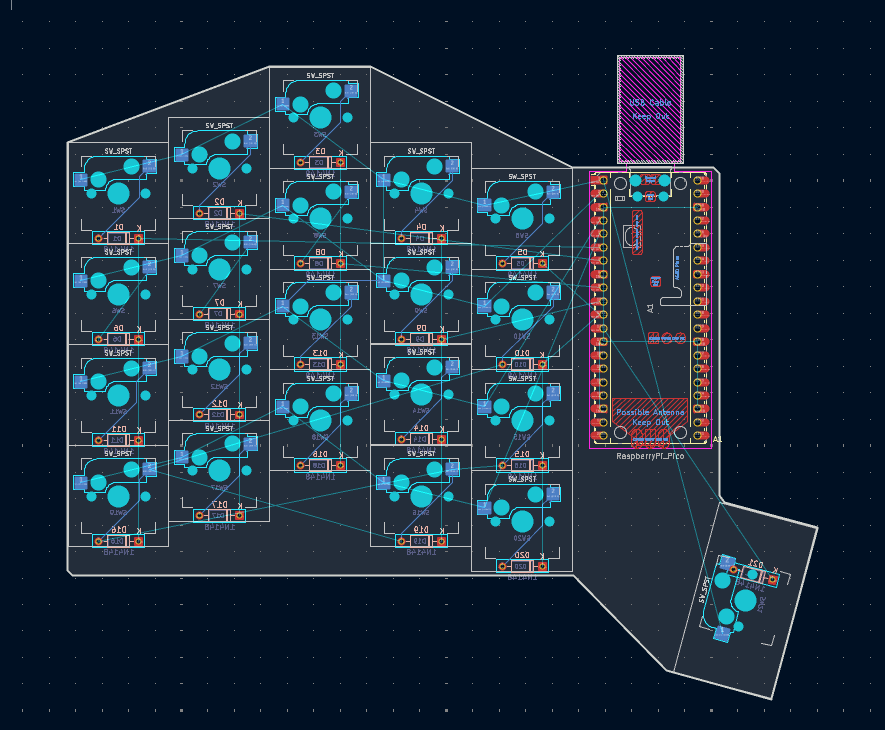
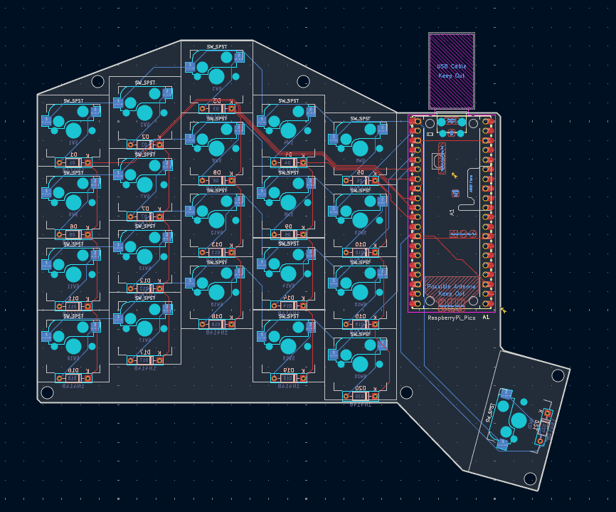

## May 23rd, 2026: Started with pcb design

I finised what I think is the final schematic. I decided against adding the joystick on this iteration and focus more time on ergonomics. I also finished placement and outline for the pcb.

**Total time spent: 3h**

## May 27th, 2026: Finished pcb design

I finished all of the pcb routing and got moutning holes on the pcb. I got pretty busy so not much work has been done, but CAD is next.

**Total time spent: 1h**